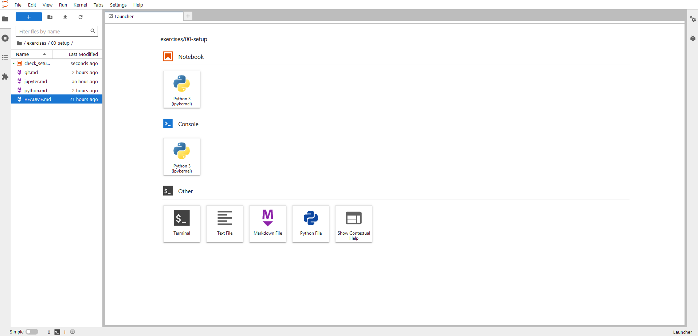
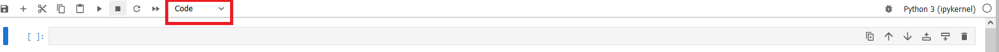
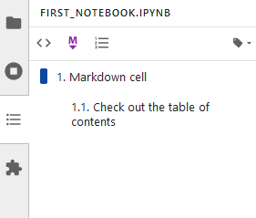

# Working with Jupyter notebooks and Jupyter Lab
This tutorial explains how to get started in the use of Jupyter Notebooks through the Jupyter Lab web-based environment. It assumes that Jupyter Lab and Jupyter Notebooks, have already been installed. If not, refer to the python setup tutorial [here](./python.md). 

## Jupyter Notebooks and Jupyter Lab
The Jupyter Notebook is a web application for creating and sharing computational documents. It offers a simple, streamlined, document-centric experience. More recently, the project Jupyter has created the Jupyter Lab, which is an advanced web-based interactive development environment for (Jupyter) notebooks, code, and data. Its flexible interface allows users to configure and arrange workflows in data science, scientific computing, computational journalism, and machine learning. All exercises, demos and labs during the course will rely on Jupyter notebooks that will be executed using Jupyter Lab.

## Launching Jupyter Lab from a terminal
Open a terminal (Mac and Linux users) or an Anaconda prompt (Windows users). Go to the root folder of the project you are working on. After activating the malis environment, type:

```bash
jupyter lab
```

This command will open your web browser on the address http://localhost:8888, which is available only in your computer. Although you will be working in your web browser, do not close the terminal that you used to launch Jupyter Lab. 

**Note:** It is also possible to launch Jupyter Lab from the Anaconda Navigator GUI. This instructions are ommited in this tutorial.

## Creating your first notebook
Once Jupyter Lab opens your web browser, you land in a page that looks as below:




On the left hand side, you see a file browser with the directory structure contained in the folder from where you launched Jupyter Lab. On the right hand side, you have the launcher interface, where you can create new files and options to work with. These different options are:

* A Python notebook. This is what we have denoted so far as a Jupyter notebook. The have the expension ipynb
* A iPython interactive console. This opens a command shell that allows you to interactively execute Python commands
* A terminal. This is the same as a system terminal (Mac and Linux) or an Anaconda prompt (Windows)
* A plain text file. This can be edited as any other standard plain text file.
* A Markdown file. You can choose how to visualize these files by right clicking on them and selecting Open With. If you are not planning to edit a file, Markdown Preview is recommended. if you will work on the file, use the editor mode.
* A Python file. Differently from notebooks, Python files cannot be executed interactively.
* The help menu

To create your first notebook, click on the notebook option. The tab will be renamed as Untitled.ipynb and a file with the same name will appear in the file browser. To rename your notebook, you can right-click on it in the file browser and select Rename.

You have just created your first Jupyter notebook!

## Interacting with a Jupyter notebook
Jupyter notebooks are made up of cells. There are three types of cells: code, markdown and raw. By default when you create a new cell it will be a code cell. The type of cell can be changed from the top menu, as indiciated below by the red box.



In the course, we will be mainly concerned about code and markdown cells.


### Markdown cells
Markdown cells are used for body-text. When they follow a structure, they enable the navigation of the notebook through the table of contents option on the left hand side bars. An example is presented below



### Code cells
Code cells are the primary content of Jupyter notebooks. They contain source code in the language of the document’s associated kernel, and a list of outputs associated with executing that code. They also have an execution_count, which must be an integer or null. A code cell can have a variety of outputs (stream data or rich mime-type output). In the example above, the first cell simply loads the libraries. The second one, instead, produces a plot as output. 

To run a single code cell you need to press the play botton in the top bar menu or use **Shift + Enter**. To run all the code cells in a notebook or a selection of them, go to the Run menu option and select the most convenient option.

As with standard non web-based IDEs, Jupyter Lab allows for code autocompletion in code cells. Similarly to other IDEs, you just need to use **Tab**.

## The Kernel
*Text extracted and adapted from: https://jupyter-notebook-beginner-guide.readthedocs.io/en/latest/what_is_jupyter.html*

A notebook kernel is a “computational engine” that executes the code contained in a Notebook document. The ipython kernel  executes python code. Kernels for many other languages exist, but in this course we will only be interested on that one of python.

When you open a Notebook document, the associated kernel is automatically launched. When the notebook is executed (either cell-by-cell or with menu Run -> Run All), the kernel performs the computation and produces the results. The different actions that can be performed to the kernel. All the actions can be found in the menu option Kernel. Some of the most used actions (play ▶, interrupt ■, restart kernel ↻ , restart and run all ) can also be found in the top bar menu in the form of buttons. A description of some of the kernel action that may be relevant for the course is provided below

* **Interrupt Kernel:** Causes the kernel to stop performing the current task without shutting down the kernel down.
* **Restart Kernel:** Stops the kernel and starts it again. This action causes you to lose all the state data. 
* **Restart and Clear:** Stops the kernel, starts it again, and clears all the existing cell outputs. This may be useful when you have been working for a while and there may be "hidden states" that alter the expected execution of your program
* **Restart Kernel and Run Up to Selected Cell:** As the previous action followed by the execution up to a specified cell
* **Restart Kernel and Run All Cells:** Differently from the previous action, here all the code cells are run
* **Shut Down Kernel:** Shuts down the kernel.
* **Change Kernel:** Selects a different kernel from the list of installed kernels. In the MALIS course context, it may be that you have different versions of Python in use and you want to switch to one of these.

## Shutting down Jupyter Lab
Once you have finished working with Jupyter Lab, first make sure you have saved your work. Then, you can shut down the Jupyter server by using **Ctrl + c** in the terminal you used to launch it.

## Useful resources
* [Jupyter Notebook documentation](https://jupyterlab.readthedocs.io/en/stable/user/notebook.html)
* [Jupyter Lab documentation](https://jupyterlab.readthedocs.io/en/stable/user/interface.html)
* [Markdown cheat sheet](https://www.markdownguide.org/cheat-sheet/)